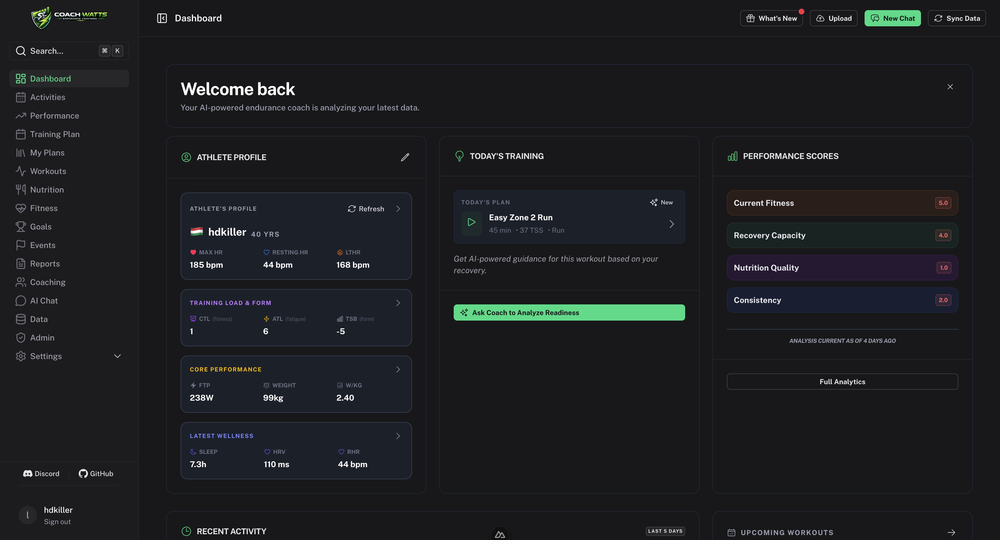
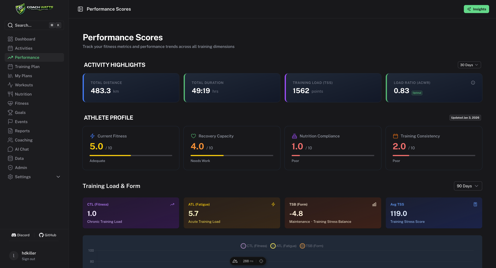
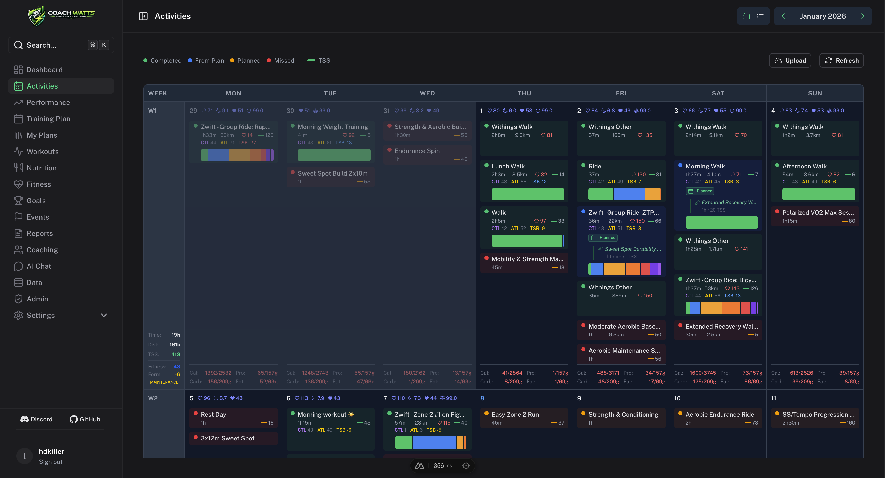
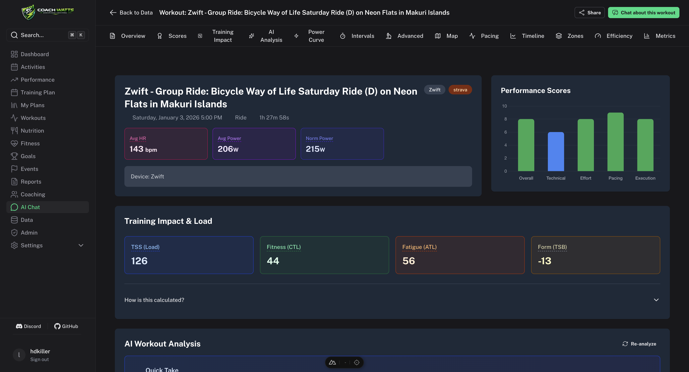
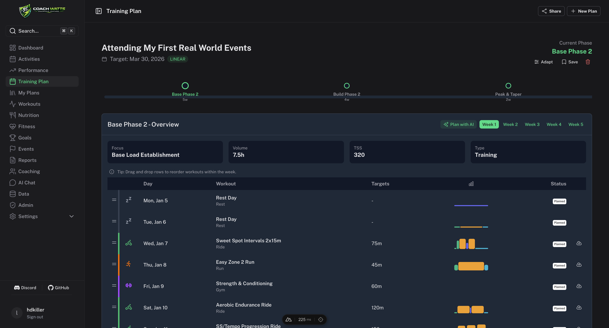
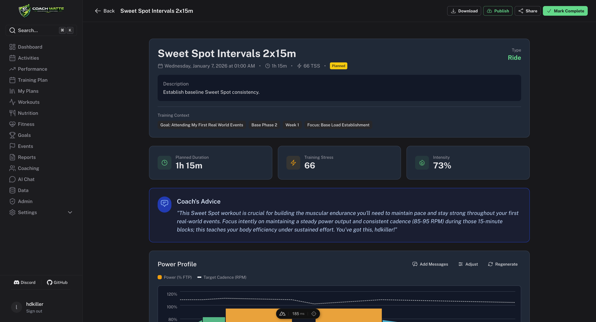
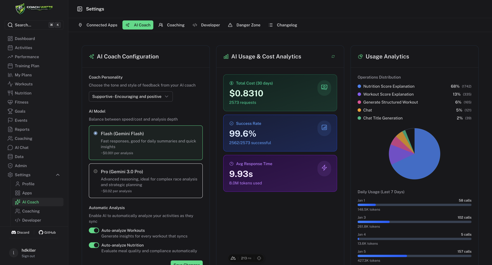

# Coach Watts

<div align="center">
  <p align="center">
    <strong>Your Open Source AI-Powered Endurance Coach</strong>
  </p>

  <p align="center">
    <a href="https://nuxt.com"></a>
    <a href="https://www.typescriptlang.org/"></a>
    <a href="https://trigger.dev"></a>
    <a href="https://ai.google.dev/"></a>
    <a href="./LICENSE"></a>
  </p>

  <p align="center">
    <a href="#key-features">Key Features</a> •
    <a href="#quick-start">Quick Start</a> •
    <a href="#integrations">Integrations</a> •
    <a href="./docs/INDEX.md">Documentation</a> •
    <a href="./public/content/releases">Release Notes</a> •
    <a href="./ACKNOWLEDGEMENTS.md">Acknowledgements</a>
  </p>
</div>

---

## 🚀 Overview

**Coach Watts** is a comprehensive, self-hosted endurance coaching platform designed for cyclists, runners, and triathletes. It acts as your "Digital Twin," aggregating data from your favorite fitness platforms and using **Google Gemini AI** to provide professional-level analysis, personalized training plans, and daily recommendations.

Unlike static dashboards, Coach Watts understands context—analyzing not just your power numbers, but your recovery, sleep, nutrition, and life stress to guide you toward peak performance.

<p align="center">
  
</p>

## ✨ Key Features

- **🔗 Unified Data Hub:** Syncs automatically with multiple fitness platforms to create a 360° view of your athlete profile.
- **🤖 AI Coach:**
  - **Workout Analysis:** Detailed breakdown of every session with execution scores.
  - **Daily Recommendations:** Smart suggestions ("Push hard" vs "Rest") based on HRV and sleep.
  - **Interactive Chat:** High-performance AI SDK v5 powered chat for data-backed answers to your training questions.
- **📈 Advanced Analytics:** Track Fitness (CTL), Fatigue (ATL), Form (TSB), and Power Curves with intuitive visualizations.
- **🥗 Nutrition Tracking:** Metabolic fueling logic (Eco/Steady/Performance) based on training intensity.
- **📅 Smart Planning:** Generate adaptive training plans that fit your schedule and goals.
- **📂 Multi-format Activity Import:** Upload `.fit`, `.gpx`, `.tcx`, or `.zip` files directly via the web UI, or bulk-import a local directory using the CLI (`cw:cli import files`).
- **🌍 Global Localization:** Fully localized platform supporting over 10 languages with smart timezone handling.
- **📢 System Messages:** Stay informed with important updates and coaching alerts directly in your dashboard.

## 🖼️ Visual Tour

|                                  **Performance Analytics**                                   |                                  **Training Calendar**                                  |
| :------------------------------------------------------------------------------------------: | :-------------------------------------------------------------------------------------: |
|  |  |

|                                 **AI Workout Analysis**                                  |                             **Adaptive Planning**                             |
| :--------------------------------------------------------------------------------------: | :---------------------------------------------------------------------------: |
|  |  |

|                                     **Planned Workouts**                                     |                               **AI Coach Settings**                                |
| :------------------------------------------------------------------------------------------: | :--------------------------------------------------------------------------------: |
|  |  |

## 🔌 Integrations

Coach Watts connects with your favorite endurance and wellness platforms:

| Platform          | Features Synced                                    |
| ----------------- | -------------------------------------------------- |
| **Intervals.icu** | Workouts, Calendar, Power Metrics, Wellness/Weight |
| **Strava**        | Activity Data, GPS Streams, Heart Rate             |
| **Whoop**         | Recovery, HRV, Sleep, Strain                       |
| **Oura**          | Readiness, Sleep, HRV, SpO2, Stress, VO2 Max       |
| **Withings**      | Body Composition (Weight, Fat %), Sleep, Wellness  |
| **Garmin**        | Activity Data, Wellness, Health Metrics            |
| **Wahoo**         | Activity Data, Workouts                            |
| **Polar**         | Training Sessions, Wellness, Recovery              |
| **Yazio**         | Nutrition Logs, Macros, Hydration                  |
| **Hevy**          | Strength Training, Exercises, Sets & Reps          |
| **Fitbit**        | Steps, Sleep, Activity, Heart Rate                 |
| **Rouvy**         | Indoor Cycling Workouts                            |
| **Ultrahuman**    | CGM Data, Glucose Monitoring                       |
| **Telegram**      | AI Coaching via Chat, Notifications                |

## 🌍 Localization

Coach Watts is built for the global endurance community. We currently support:

- **English** (en), **German** (de), **Spanish** (es), **French** (fr)
- **Hungarian** (hu), **Italian** (it), **Japanese** (ja), **Dutch** (nl)
- **Russian** (ru), **Chinese** (zh)

We use **Tolgee** for managing translations. If you'd like to help translate Coach Watts into your language, please join our [Discord](https://discord.gg/dPYkzg49T9)!

## ⚡ Quick Start

### Prerequisites

- Docker & Docker Compose
- Google Cloud Account (for Auth & Gemini API)
- Node.js 22+ _(local development only)_

### Option A — Docker (recommended for self-hosting)

Run the full stack (app + PostgreSQL + DragonflyDB) with a single command:

```bash
git clone git@github.com:pnposch/coach.git
cd coach
cp .env.example .env
```

Edit `.env` — at minimum fill in:

| Variable                                    | Description                                                               |
| ------------------------------------------- | ------------------------------------------------------------------------- |
| `POSTGRES_PASSWORD`                         | Postgres password (also used to build `DATABASE_URL` inside Docker)       |
| `DRAGONFLY_PASSWORD`                        | Redis/DragonflyDB password (also used to build `REDIS_URL` inside Docker) |
| `GOOGLE_CLIENT_ID` / `GOOGLE_CLIENT_SECRET` | Google OAuth credentials                                                  |
| `GEMINI_API_KEY`                            | Google Gemini API key                                                     |
| `NUXT_AUTH_SECRET`                          | Random secret for session signing (`openssl rand -hex 32`)                |
| `NUXT_AUTH_ORIGIN`                          | Full URL of your instance, e.g. `https://coach.example.com/api/auth`      |

> **Note:** `DATABASE_URL` and `REDIS_URL` are automatically constructed from the credentials above when running via docker-compose — you don't need to set them manually.

```bash
docker-compose up -d
```

The app will be available at `http://localhost:3000`. Database migrations run automatically on startup.

#### Single-user / local mode (no OAuth required)

If you don't want to set up Google/Strava OAuth apps, you can run in **single-user mode**: all OAuth buttons are replaced with a simple email + password form, and the local user is created automatically on first login.

Add to your `.env`:

```env
NUXT_SINGLE_USER_MODE=true
AUTH_BYPASS_USER=you@example.com
AUTH_BYPASS_PASSWORD=<strong-password>
AUTH_BYPASS_NAME=Admin          # optional display name
```

Then start with the single-user compose override:

```bash
docker compose -f docker-compose.yml -f docker-compose.single-user.yml up -d
```

Or simply set `NUXT_SINGLE_USER_MODE=true` in `.env` and use the standard `docker-compose up -d`.

### Option B — Local Development

```bash
git clone git@github.com:pnposch/coach.git
cd coach
cp .env.example .env
pnpm install
```

Start backing services (PostgreSQL + DragonflyDB):

```bash
docker-compose up -d postgres dragonfly
# PostgreSQL available on localhost:5439
# DragonflyDB available on localhost:6379
```

Configure your `.env` (see table above), then set `DATABASE_URL` and `REDIS_URL` to point at `localhost`.

Run migrations and start the dev server:

```bash
npx prisma migrate dev
pnpm dev
```

Visit `http://localhost:3099`.

### 🛠️ CLI Tools

Coach Watts includes a powerful CLI for administrative tasks:

```bash
# General help
pnpm cw:cli --help

# Monitor Trigger.dev status
pnpm cw:cli trigger list --prod

# Manage users and locations
pnpm cw:cli users location list-missing
```

### 📂 Bulk Activity File Import

You can import `.fit`, `.gpx`, and `.tcx` files in two ways:

#### Via the web UI

Navigate to **Workouts → Upload** and drag-drop or select files. Supported formats: `.fit`, `.gpx`, `.tcx`, `.zip`.

#### Via Docker (bulk import from a local directory)

Mount a host directory into the container by setting `ACTIVITY_IMPORT_DIR` in your `.env`:

```env
ACTIVITY_IMPORT_DIR=/path/to/your/activity/files
```

Then restart the stack and run the CLI inside the container:

```bash
docker compose up -d

# Import all files for a user (dry-run first to preview)
docker exec watts-app pnpm cw:cli import files you@example.com --dir /imports --dry-run

# Import for real
docker exec watts-app pnpm cw:cli import files you@example.com --dir /imports

# Recurse into subdirectories (e.g. Garmin exports with year folders)
docker exec watts-app pnpm cw:cli import files you@example.com --dir /imports --recursive
```

The directory is mounted **read-only** at `/imports` inside the container. Files are deduplicated by SHA-256 hash — re-running the import on the same directory is safe. Workouts appear in the dashboard as the background queue processes each file.

#### Via the CLI locally (without Docker)

If you're running the app locally (`pnpm dev`), you can import directly:

```bash
pnpm cw:cli import files you@example.com --dir ~/Downloads/garmin-export/Activities
pnpm cw:cli import files you@example.com --dir ~/exports --recursive --dry-run
```

## 📚 Documentation

We have extensive documentation available in the [`docs/`](./docs) directory:

- [**Architecture**](./docs/01-architecture/system-overview.md): System design and data flow.
- [**Database Schema**](./docs/01-architecture/database-schema.md): Detailed Prisma models.
- [**Timezone Handling**](./docs/04-guides/timezone-handling.md): How we manage global athlete data.
- [**Chat Development**](./docs/04-guides/chat-development.md): Strict AI SDK & Gemini sequencing rules.
- [**Release Notes**](./public/content/releases): Detailed change logs for each version.
- **Feature Guides**:
  - [AI Chat System](./docs/02-features/chat/overview.md)
  - [Nutrition Logic](./docs/02-features/nutrition/fueling-logic.md)
  - [Scoring System](./docs/02-features/analytics/scoring-system.md)
  - [Integration Guides](./docs/INDEX.md#03-integrations)

## 🤝 Contributing

We welcome contributions! Whether it's fixing bugs, improving documentation, or suggesting new features.

1. Fork the repo.
2. Create a branch (`git checkout -b feature/amazing-feature`).
3. Commit your changes.
4. Push to the branch.
5. Open a Pull Request.

## 📄 License

Distributed under the Apache License 2.0. See [`LICENSE`](./LICENSE) for more information. Acknowledgements of third-party assets and contributors can be found in [`ACKNOWLEDGEMENTS.md`](./ACKNOWLEDGEMENTS.md).

### Is Coach Watts open source?

Yes. Coach Watts is open source using the Apache 2.0 license. We are committed to open source software and working with our community to build a great product.

## ❤️ Community & Support

- **Discord:** [Join our Server](https://discord.gg/dPYkzg49T9)
- **GitHub:** [Star us on GitHub](https://github.com/hdkiller/coach)
- **Issues:** [Report a Bug](https://github.com/hdkiller/coach/issues)

---

<p align="center">
  Made with ❤️ for endurance athletes.
</p>
