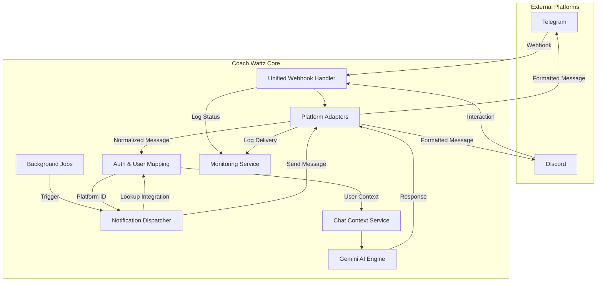

# Multi-Platform Messaging Architecture

This document outlines the architecture for extending Coach Wattz's AI coaching capabilities to external messaging platforms like **Telegram** and **Discord**.

## 1. Overview

The goal is to create a **Unified Messaging Gateway** that allows the AI Coach to interact with users across different platforms while maintaining a single source of truth for user context, history, and coaching logic.

### Key Principles

- **Platform Agnostic Core:** The AI logic, context building, and tool execution should not know _which_ platform the user is on.
- **Adapters:** Specific adapters handle platform-specific API quirks (Markdown parsing, limits, UI elements).
- **Unified Identity:** A single Coach Wattz user can link multiple messaging accounts (Telegram, Discord, etc.) via the existing `Integration` system.

## 2. System Architecture



## 3. Data Model

We utilize the existing `Integration` model to link external platform identities to the internal `User`.

```prisma
model Integration {
  userId         String
  provider       String    // "telegram", "discord"
  externalUserId String    // Telegram ChatID or Discord UserID

  // Platform-specific metadata (optional)
  accessToken    String?   // Discord OAuth token (if needed)
  refreshToken   String?
  // ...
}
```

### Chat Persistence

- **Rooms:** Each platform integration creates a dedicated `ChatRoom` (e.g., "Telegram Link", "Discord DM").
- **History:** Messages are stored in `ChatMessage` tables. This enables:
  - Debugging.
  - Future "Unified Inbox" in the web dashboard.
  - Consistent short-term memory for the AI.

## 4. Platform Specifics

### 4.1. Telegram Integration

- **Communication Mode:** Webhooks (`POST /api/integrations/telegram/webhook`).
- **Authentication:** Deep Linking.
  1.  User clicks `t.me/CoachWattzBot?start=<token>` on dashboard.
  2.  Bot receives `/start <token>`.
  3.  Backend verifies token and links `chat_id` to `userId`.
- **Formatting:** Limited HTML or MarkdownV2.
- **UI Elements:** Custom Keyboards (ReplyMarkup) for simple choices (Yes/No).

### 4.2. Discord Integration

- **Communication Mode:** Interactions Endpoint (`POST /api/integrations/discord/webhook`).
  - _Note:_ Using an HTTP Interactions Endpoint is preferred over a WebSocket Gateway bot for a serverless/Nuxt architecture.
- **Authentication:** OAuth2.
  1.  User clicks "Connect Discord" on dashboard.
  2.  Standard OAuth2 flow redirects to Discord to authorize bot (scopes: `bot`, `applications.commands`).
  3.  Callback stores `discord_user_id` and potentially joins a dedicated server or enables DM.
- **Formatting:** standard Markdown.
- **UI Elements:** Buttons and Select Menus (Message Components) are robust and supported.

## 5. Unified Message Processing Pipeline

To avoid code duplication, we implement a **Pipeline Pattern**:

1.  **Ingest:** Platform-specific endpoint receives request, validates signature (Ed25519 for Discord, Secret Token for Telegram).
2.  **Normalize:** Convert incoming payload to a standard internal object:
    ```typescript
    interface IncomingMessage {
      platform: 'telegram' | 'discord'
      externalId: string // chat_id or user_id
      content: string
      type: 'text' | 'command'
    }
    ```
3.  **Resolve User:** Look up `User` via `Integration` table using `externalId`.
    - _Unlinked:_ Reply with "Please link your account via the Dashboard."
4.  **Execute AI:**
    - Build Context (`buildAthleteContext`).
    - Call `google(model)`.
    - **Tool Handling:** Execute tools. If a tool returns a complex object (like a chart config), the AI should describe it textually.
5.  **Adapt Response:**
    - **Telegram:** Convert `**bold**` to `*bold*` (MarkdownV2), strip unsupported tags.
    - **Discord:** Ensure message length < 2000 chars (chunk if necessary).
6.  **Send:** Dispatch to platform API.

## 6. Proactive Messaging (Outbound)

This architecture explicitly supports "Push" notifications (e.g., Daily Check-ins, Workout Reminders) initiated by background jobs.

### 6.1. The Notification Dispatcher

A service responsible for routing system messages to the user's preferred or connected platforms.

- **Trigger:** Background jobs (e.g., `daily-checkin`) call `NotificationService.send(userId, message)`.
- **Routing Logic:**
  1.  Check `Integration` table for connected providers (`telegram`, `discord`).
  2.  If multiple exist, use user preference (default to all or last active).
- **Platform Execution:**
  - **Telegram:** Use `sendMessage` API with the stored `chat_id`.
    - _Requirement:_ Bot must not be blocked by user.
  - **Discord:** Use `Create Message` API.
    - _Requirement:_ Bot must have a valid DM channel open. If not, create one using `Create DM` endpoint with the stored `user_id`.

## 7. Bot Commands & Extended Features

This section details the functionalities that are unique or adapted for the messaging interface, differentiating it from the web chat.

### 7.1. Standard Commands

These commands are consistent across Telegram and Discord:

- `/start [token]` - Initializes the conversation or links the account.
- `/help` - Lists available commands and capabilities.
- `/settings` - Adjust bot preferences (e.g., notification frequency).
- `/stop` or `/unlink` - disconnects the bot.

### 7.2. Coaching Commands

Quick access to frequent coaching actions without needing natural language processing:

- `/workout` - "What is my plan for today?" (Returns summary of today's training).
- `/stats` - "How is my week going?" (Returns textual summary of weekly load/compliance).

### 7.3. Viral Growth: The Invite System

To leverage the social nature of these platforms:

- **Command:** `/invite`
- **Action:** Bot generates a unique referral link (e.g., `t.me/CoachWattzBot?start=ref_<userId>`).
- **Response:** "Invite a friend to train smarter! Share this link: [Link]. When they join, they'll get a 7-day extended trial."
- **Flow:**
  1.  User A sends link to User B.
  2.  User B clicks link -> Bot sends "Welcome! User A invited you."
  3.  Bot provides a "Sign Up & Claim Trial" button pointing to the web registration page with the referral code pre-filled.

### 7.4. Extended Capabilities (Mobile-First)

Features that leverage the native capabilities of mobile messaging apps:

- **Voice Notes:** Users can record a post-workout debrief (e.g., "That run was tough, my knee hurt at km 5"). The bot will transcribe the audio (via Whisper API) and log the RPE/Notes to the workout.
- **Rich Media Upload:** Users can upload a photo of their meal. The bot (via Gemini Vision) analyzes the nutrition content (already in web, but more native here).
- **Quick Actions (Buttons):** Instead of typing "Yes I did it", the bot sends a "Did you complete the workout?" message with `[Yes, as planned]` `[Yes, but modified]` `[No, skipped]` buttons.

## 8. Monitoring & Analytics (Admin)

To track usage and health, we will implement a dedicated monitoring layer viewable in the Admin Dashboard.

### 8.1. Data Collection Strategy

We will leverage existing tables plus aggregated queries:

- **Incoming Traffic:** Tracked via `WebhookLog` (provider: 'telegram', 'discord').
- **Outbound/Interaction Stats:** Derived from `ChatMessage` and `LlmUsage`.
  - `ChatMessage.metadata`: Will now include `{ source: 'telegram' }` or `{ source: 'discord' }`.
- **Delivery Failures:** Recorded in `WebhookLog` (for inbound) or a new `MessagingLog` if strictly needed for outbound failures. _Decision: Reuse `WebhookLog` for now, utilizing a new eventType `OUTBOUND_FAILURE` if we need to track push failures._

### 8.2. Admin Dashboard (`/admin/stats/messaging`)

A new page in the Admin panel will visualize:

- **Overview Cards:**
  - Active Telegram Users (Total `Integration` count).
  - Active Discord Users.
  - Messages Sent Today (Split by platform).
- **Charts:**
  - **Message Volume (7d):** Stacked bar chart of inbound/outbound messages per platform.
  - **Response Latency:** Avg time for AI to reply via webhook.
- **Error Log:**
  - Table of recent `WebhookLog` entries filtered by status `FAILED`, allowing admins to see if Telegram/Discord APIs are rejecting our requests (e.g., 403 Forbidden if user blocked bot).

## 9. Development Roadmap

### Phase 1: Core & Telegram (MVP)

- [ ] Refactor `chatContextService` to be completely decoupled from HTTP Request objects (if not already).
- [ ] Implement `TelegramAdapter` and Webhook.
- [ ] Implement Deep Link Auth flow.
- [ ] Implement `/invite` and `/workout` commands.
- [ ] Add `Messaging Stats` page to Admin Dashboard.

### Phase 2: Discord Support

- [ ] Register Discord Application.
- [ ] Implement `DiscordAdapter` and Interactions Endpoint validation (Ed25519).
- [ ] Implement OAuth2 flow for "Add to Server" / "DM" permissions.

### Phase 3: Advanced Features

- [ ] **Proactive Notifications:** System for sending daily summaries/alerts to _connected_ messaging platforms (Push -> Pull).
- [ ] **Rich UI:** Implement platform-specific buttons for "Confirm Workout" or "Log Check-in".
- [ ] **Voice Support:** Add transcription handling.

## 10. Configuration

```env
# Telegram
TELEGRAM_BOT_TOKEN=...
TELEGRAM_WEBHOOK_SECRET=...

# Discord
DISCORD_APP_ID=...
DISCORD_PUBLIC_KEY=... # For verifying interactions
DISCORD_BOT_TOKEN=...
```
