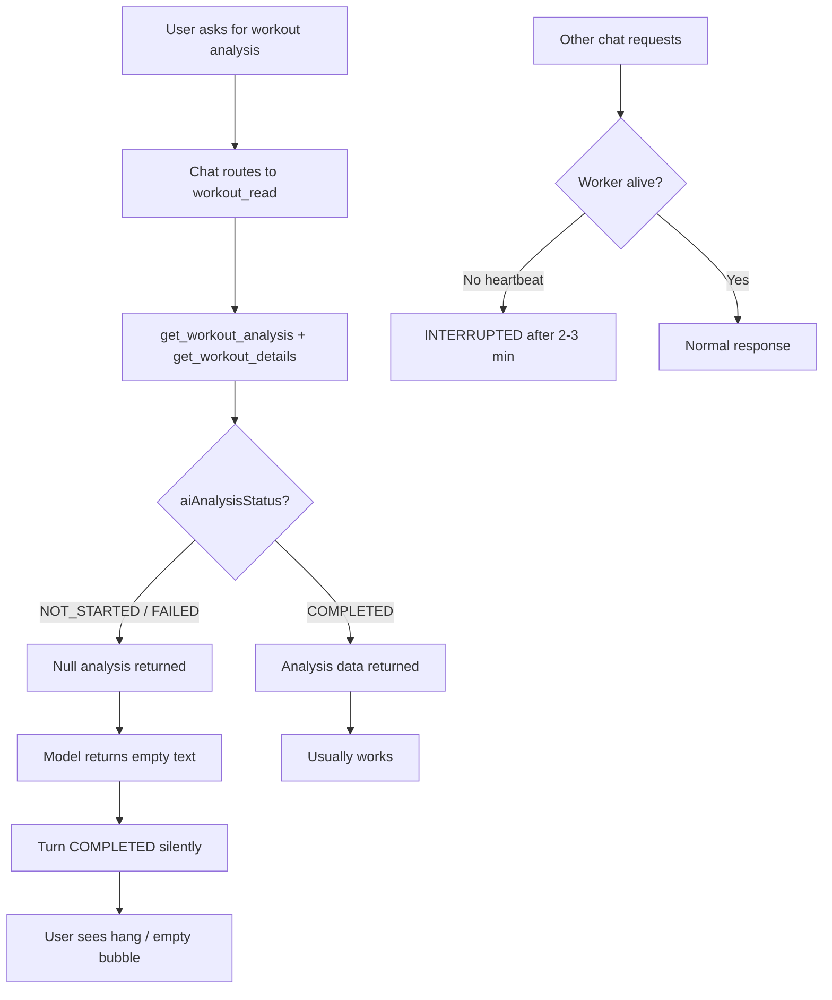

# Chat Workout Analysis Investigation — 2026-07-12

## Purpose

This document captures a production investigation into chat "hangs" during workout analysis. It was triggered by support ticket `de0f54ae-4253-436c-a2f0-1afc5e4ffbd7` (athlete: Dima / Dzmitry Suravets) and expanded to cross-user analysis using `cw:cli` tools.

**Audience:** Another agent or engineer reviewing root cause, scope, and fix priority.

---

## Trigger Ticket

| Field     | Value                                                                     |
| --------- | ------------------------------------------------------------------------- |
| Ticket ID | `de0f54ae-4253-436c-a2f0-1afc5e4ffbd7`                                    |
| Status    | IN_PROGRESS                                                               |
| User      | Dzmitry Suravets (`49dadbeb-215e-400c-8b41-fe52af8f9c6b`)                 |
| Email     | dzmitrysuravets@gmail.com                                                 |
| Report    | Chat "hangs" when requesting workout analysis; issue reported for ~3 days |

---

## Investigation Method

All data pulled from **production** via `cw:cli`:

```bash
pnpm cw:cli support tickets get de0f54ae-4253-436c-a2f0-1afc5e4ffbd7 --prod
pnpm cw:cli debug chatroom --user 49dadbeb-215e-400c-8b41-fe52af8f9c6b --prod --limit 15
pnpm cw:cli debug athlete 49dadbeb-215e-400c-8b41-fe52af8f9c6b --prod
pnpm cw:cli db sql "<query>" --prod
```

Key queries used for cross-user mapping:

- Empty assistant turns: `COALESCE(LENGTH(TRIM(am.content)), 0) <= 1`
- Skill filter: `ct.metadata->'skillSelection'->'skillIds'`
- Tool activity: `jsonb_array_length(am.metadata->'toolCalls')`
- Workout analysis template: `cm.content LIKE 'Please analyze my completed workout%'`

---

## Executive Summary

Dima's report is **confirmed and valid**, but this is **not an isolated user bug**. Over the last 7 days:

| Metric                                     | Value                                  |
| ------------------------------------------ | -------------------------------------- |
| Total chat turns                           | 723                                    |
| Empty assistant replies                    | **111 (15.4%)**                        |
| Distinct affected users                    | **13**                                 |
| `workout_read` empty turns                 | **53**                                 |
| Standard workout-analysis UI requests      | 38 total, **16 empty (42% fail rate)** |
| Empty turns calling `get_workout_analysis` | **32**, all marked `COMPLETED`         |

There are **four distinct failure modes**. The dominant one for workout analysis is:

1. Background workout AI analysis is mostly **not running** (`NOT_STARTED` / `FAILED`).
2. Chat fetches empty analysis via `get_workout_analysis`.
3. Model returns **no text** after tools complete.
4. Turn executor marks turn **`COMPLETED`** because tool activity counts as output → user sees a hang / empty bubble.

---

## Issue Map



---

## Issue 1 — Silent Empty Completion After Tools (PRIMARY)

### Symptom

Tools execute successfully, turn status is `COMPLETED`, but assistant message text is blank (or whitespace only). From the user's perspective the chat "hangs" or shows no reply.

### Scope (7 days, prod)

| Metric                                          | Count              |
| ----------------------------------------------- | ------------------ |
| Completed empty turns **with tool calls**       | 66                 |
| Of those, called `get_workout_analysis`         | 32                 |
| `workout_read` skill empty turns (all statuses) | 53                 |
| "Please analyze my completed workout…" requests | 38 total, 16 empty |

### Typical flow (confirmed on Dima and other users)

1. User opens **"Workout Performance Analysis"** room (UI template).
2. User message: `Please analyze my completed workout with ID <uuid>. How did I perform?`
3. Router selects `workout_read` (+ sometimes `analysis`).
4. Tools run: `get_workout_analysis`, `get_workout_details` — both `COMPLETED`.
5. `get_workout_analysis` returns `aiAnalysisStatus: NOT_STARTED` or `FAILED`, all score/analysis fields `null`.
6. Assistant content: empty or single whitespace.
7. Turn: `COMPLETED` in ~5s.

### Example: Dima — turn `9677b06d-9609-4d25-9666-9bf8b1004b25`

| Field                      | Value                                                          |
| -------------------------- | -------------------------------------------------------------- |
| Room                       | `b9b1fc03-6039-4dec-ac5e-24f4ded63678`                         |
| Workout                    | `7de3d232-3b6a-4c60-9df5-fc87d13d730f` (Sunday Recovery Flush) |
| Tools                      | `get_workout_analysis`, `get_workout_details`                  |
| Assistant text             | empty (1 whitespace char)                                      |
| Workout `aiAnalysisStatus` | `NOT_STARTED`                                                  |

Same pattern on Jul 10 for workout `cc7799f4-a62d-4f56-b3b0-d1c87bf9e936` (`FAILED`).

### Root cause (chat executor)

In `server/utils/chat/turn-executor.ts`, empty-response fallback only triggers when there is **no meaningful text AND no tool activity**:

```typescript
const hasMeaningfulText = typeof assistantText === 'string' && assistantText.trim().length > 0
const hasToolActivity = (finalStepResults?.length || 0) > 0 || ...
const shouldFallbackForEmptyResponse = !hasMeaningfulText && !hasToolActivity
```

When tools ran but text is empty, `shouldFallbackForEmptyResponse` is **false** → turn completes silently with no fallback message and no retry.

Related: `app/utils/chat-message-state.ts` — if `toolCalls` exist in metadata, bubble is not hidden (`hasVisibleAssistantArtifacts`), but there may still be no readable answer.

### Root cause (pipeline)

Global workout AI analysis status (last 7 days, non-duplicate workouts):

| Status        | Count     |
| ------------- | --------- |
| `NOT_STARTED` | **4,578** |
| `COMPLETED`   | 71        |
| `FAILED`      | 13        |

Background `analyze-workout` is largely not producing analysis. Chat then reads empty data and fails to respond.

Dima's recent workouts:

| Workout                | Date   | `aiAnalysisStatus`    |
| ---------------------- | ------ | --------------------- |
| Sunday Recovery Flush  | Jul 12 | `NOT_STARTED`         |
| Saturday Z2 Spin       | Jul 11 | `COMPLETED` (score 7) |
| Friday Tempo/Endurance | Jul 10 | `FAILED`              |
| Thursday Volume Base   | Jul 9  | `NOT_STARTED`         |

User settings: `aiAutoAnalyzeWorkouts: true`, tier `PRO`, `aiRequireToolApproval: false`.

### Most affected users (`workout_read` empty turns, 7 days)

| User                                      | Empty `workout_read` turns |
| ----------------------------------------- | -------------------------- |
| Алексей (ashinkevich88@gmail.com)         | 19                         |
| Ralf Gieske (ralf.gieske@googlemail.com)  | 10                         |
| **Dima (dzmitrysuravets@gmail.com)**      | **8**                      |
| D4wnbr1ng3r (tartharus@yahoo.de)          | 4                          |
| Glenn Sneyders (glenn.sneyders@gmail.com) | 4                          |

### Daily trend

| Date       | All empty turns | `workout_read` empty |
| ---------- | --------------- | -------------------- |
| Jul 9      | 15              | 6                    |
| **Jul 10** | **39**          | **24**               |
| Jul 11     | 18              | 6                    |
| Jul 12     | 15              | 9                    |

Jul 10 was the worst day — likely when multiple users started hitting this at scale.

### Suggested fixes

| Priority | Fix                                                                                                                                         |
| -------- | ------------------------------------------------------------------------------------------------------------------------------------------- |
| P0       | Treat "tools ran + empty text" as failure: retry or show fallback in `turn-executor.ts`                                                     |
| P0       | Investigate why `analyze-workout` pipeline is stalled (4,578 `NOT_STARTED`)                                                                 |
| P1       | When `get_workout_analysis` returns `NOT_STARTED`/`FAILED`, auto-trigger `analyze_activity` or synthesize answer from `get_workout_details` |
| P1       | Improve chat skill instructions for missing analysis                                                                                        |

---

## Issue 2 — Heartbeat Timeout (SECONDARY)

### Symptom

Turn runs ~2–3 minutes with no visible output, then `INTERRUPTED` with empty assistant text.

### Scope

- **44 turns** in 7 days
- `failureReason`: `Turn interrupted after heartbeat timeout.`
- Affects multiple skills: `general_chat`, `profile`, `memory`, `workout_read`

### Example: Dima — Jul 11

Room `2ffc4a87-fd56-49a1-9092-e6a07414a2cc`: **6 consecutive** `INTERRUPTED` turns with heartbeat timeout (not all workout-analysis-related).

Alexey (ashinkevich88@gmail.com) has the highest volume of interrupted empty turns overall (42 total empty turns in 7 days, many interrupted).

### Suggested fixes

| Priority | Fix                                                           |
| -------- | ------------------------------------------------------------- |
| P1       | Investigate chat turn worker liveness / heartbeat recovery    |
| P2       | Surface timeout state clearly in UI (not silent empty bubble) |

---

## Issue 3 — Tool-Enabled Without Tool Execution (TERTIARY)

### Symptom

Router sets `useTools: yes`, model responds in plain text without calling required tools, turn `COMPLETED`.

### Examples

- Glenn: `planning_write` — user asks to schedule ride; assistant claims plan updated, **no `update_planned_workout` call**
- Alexey: `memory`, `nutrition`, `planning_read` with `useTools: yes` but zero tool executions
- `chatroom` CLI finding: `tool_enabled_without_tool_execution`

### Suggested fixes

| Priority | Fix                                                                          |
| -------- | ---------------------------------------------------------------------------- |
| P2       | Strengthen execution integrity checks when `useTools: true` and no tools ran |
| P2       | Retry or repair prompt for write/mutation skills                             |

---

## Issue 4 — Prisma Metadata Serialization Crash (RARE)

### Symptom

Turn `FAILED` mid-stream during draft persist.

### Scope

1 turn in 7 days.

### Cause

Tool metadata contained non-serializable Zod function refs (`addIssue`) from invalid `create_chart` input. Prisma `chatMessage.update()` failed while persisting draft.

### Suggested fixes

| Priority | Fix                                                                             |
| -------- | ------------------------------------------------------------------------------- |
| P3       | Sanitize tool metadata before persist (strip functions / invalid tool payloads) |

---

## Cross-User Empty Turn Breakdown (7 days)

### By status + failure reason

| Status      | Failure reason             | Count |
| ----------- | -------------------------- | ----- |
| COMPLETED   | none                       | 66    |
| INTERRUPTED | heartbeat timeout          | 44    |
| FAILED      | Prisma serialization error | 1     |

### By skill (top patterns)

| Status      | Skills                     | Count |
| ----------- | -------------------------- | ----- |
| COMPLETED   | `workout_read`             | 25    |
| COMPLETED   | `workout_read`, `analysis` | 9     |
| INTERRUPTED | `general_chat`             | 10    |
| INTERRUPTED | `workout_read`             | 6     |
| INTERRUPTED | `profile`                  | 5     |

### Top users by total empty turns

| User                              | Empty turns |
| --------------------------------- | ----------- |
| Алексей (ashinkevich88@gmail.com) | 42          |
| Dima (dzmitrysuravets@gmail.com)  | 15          |
| Glenn Sneyders                    | 14          |
| Ralf Gieske                       | 14          |

---

## Key Code References

| Area                   | Path                                                                             |
| ---------------------- | -------------------------------------------------------------------------------- |
| Empty-response logic   | `server/utils/chat/turn-executor.ts` (~1148–1237)                                |
| Bubble visibility      | `app/utils/chat-message-state.ts`                                                |
| Workout analysis tool  | `server/utils/ai-tools/workouts.ts` (`get_workout_analysis`, `analyze_activity`) |
| Workout analysis task  | `trigger/analyze-workout.ts`                                                     |
| Chat skill routing     | `server/utils/chat/skills.ts` (`workout_read`, `workout_update`)                 |
| Chatroom diagnostics   | `cli/debug/chatroom.ts`                                                          |
| Empty failure backfill | `cli/backfill/chat-empty-failures.ts`                                            |

---

## Reproduction Queries (for reviewer)

```bash
# Dima's latest analysis room
pnpm cw:cli debug chatroom --user 49dadbeb-215e-400c-8b41-fe52af8f9c6b --prod --limit 15

# Cross-user empty turn rate
pnpm cw:cli db sql "SELECT COUNT(*)::int as total_turns, SUM(CASE WHEN COALESCE(LENGTH(TRIM(am.content)),0) <= 1 THEN 1 ELSE 0 END)::int as empty_turns FROM \"ChatTurn\" ct JOIN \"ChatMessage\" am ON am.id = ct.\"assistantMessageId\" WHERE ct.\"createdAt\" >= NOW() - INTERVAL '7 days'" --prod

# Workout analysis template fail rate
pnpm cw:cli db sql "SELECT COUNT(*)::int as total, SUM(CASE WHEN COALESCE(LENGTH(TRIM(am.content)),0) <= 1 THEN 1 ELSE 0 END)::int as empty_cnt FROM \"ChatTurn\" ct JOIN \"ChatMessage\" cm ON cm.id = ct.\"userMessageId\" JOIN \"ChatMessage\" am ON am.id = ct.\"assistantMessageId\" WHERE ct.\"createdAt\" >= NOW() - INTERVAL '7 days' AND cm.content LIKE 'Please analyze my completed workout%'" --prod

# Global workout analysis pipeline health
pnpm cw:cli db sql "SELECT \"aiAnalysisStatus\", COUNT(*)::int as cnt FROM \"Workout\" WHERE date >= NOW() - INTERVAL '7 days' AND \"isDuplicate\" = false GROUP BY \"aiAnalysisStatus\" ORDER BY cnt DESC" --prod
```

---

## Recommended Review Order for Next Agent

1. **Confirm Issue 1 in code** — read `turn-executor.ts` empty-response branch; verify tools + empty text bypasses fallback.
2. **Confirm pipeline stall** — trace what triggers `analyze-workout` after ingest; why 4,578 workouts remain `NOT_STARTED`.
3. **Sample 2 more users** — Alexey (`f5dd98da-fbc0-4774-90c8-135567d2b911`), Ralf (`e077f5d7-afb4-4c70-9af3-2b54e682b4e4`) with `cw:cli debug chatroom --user <id> --prod`.
4. **Heartbeat timeouts** — check `server/utils/chat/turn-runner.ts` and worker health around Jul 10–11.
5. **Propose minimal fix** — likely two-part: (a) chat executor guard for empty-after-tools, (b) pipeline/orchestration for `analyze-workout`.

---

## Immediate Mitigation (ops)

Backfill pending analyses for Dima's recent workouts:

```bash
pnpm cw:cli trigger workout analyze 7de3d232-3b6a-4c60-9df5-fc87d13d730f --prod
pnpm cw:cli trigger workout analyze 8d8fc301-3bab-4277-a4c3-447cb3fdd6c8 --prod
pnpm cw:cli trigger workout analyze cc7799f4-a62d-4f56-b3b0-d1c87bf9e936 --prod
```

Then ask athlete to retry analysis in room `b9b1fc03-6039-4dec-ac5e-24f4ded63678`.

---

## Open Questions

1. What changed around **Jul 9–10** that caused the spike (deploy, Trigger.dev queue, orchestration change)?
2. Is `analyze-workouts` orchestration task running per user sync, or only on-demand?
3. Why does the model return empty text after successful tool calls — model regression, prompt gap, or token/step limit?
4. Are heartbeat timeouts correlated with a specific worker instance or deployment?

---

## Status

- Investigation: **complete**
- Code fix: **not yet applied**
- Ticket `de0f54ae`: **IN_PROGRESS**
