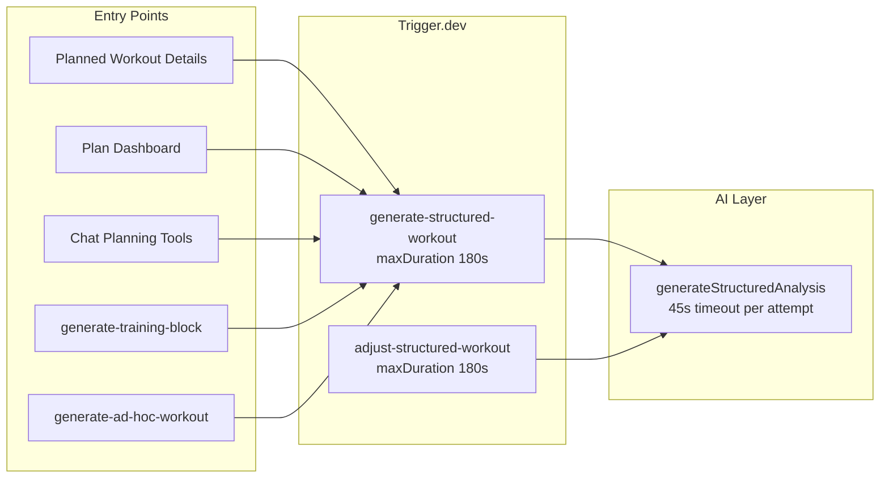

# Workout Details Generation — Issue Tracker

Last reviewed: 2026-07-07

This tracker documents bugs, UX gaps, and architectural concerns found during a code review of **planned workout structure generation** (the AI pipeline that produces interval steps, strength blocks, coach instructions, and related metadata for the Planned Workout Details page).

No code changes were made as part of this review — only issue documentation.

## Scope

**In scope**

- `generate-structured-workout` and related Trigger.dev tasks
- API endpoints that enqueue structure generation
- Planned Workout Details UI monitoring and feedback
- Chat planning tools that trigger background generation
- Timeout and retry behavior for AI calls inside triggers

**Out of scope (related but separate)**

- Completed workout AI analysis (`analyze-workout`)
- Read-only chat tools (`get_workout_details`, `get_planned_workout_details`)
- Intervals.icu publish/sync failures (deferred in support tracker)

## Architecture Summary

Chat turns have a separate **60s execution timeout** (`CHAT_TURN_EXECUTION_TIMEOUT_MS`). Structure generation is correctly offloaded to Trigger.dev in most paths, but several triggers still run **synchronous multi-attempt AI** inside the task body, which can approach the 180s task cap.

## Production Context

Prior support investigation confirms an active defect family around **zero-step structured workouts** (description-only `structuredWorkout` payloads with `step_count = 0`). See:

- [support-ticket-task-list-2026-06-16.md](../06-plans/support-ticket-task-list-2026-06-16.md) — cluster 3
- [support-ticket-handoff-2026-06-25.md](../06-plans/support-ticket-handoff-2026-06-25.md)

Anchor support tickets: `0d62fa04-884d-4fcd-a328-2226f2eb4ad5`, `a232e0ab-245e-4e95-ac37-e03fa7db6e37`, `10565730-46cd-4422-bef3-edf8b16d7df7`

## Issues

| ID | Title | Priority | Type | Status |
|----|-------|----------|------|--------|
| [001](./001-zero-step-structure-persistence.md) | Empty structures can persist as successful generation | Critical | Bug | Open |
| [002](./002-missing-planned-workout-run-tags.md) | Manual/API triggers missing `planned-workout:` run tags | High | Bug | Open |
| [003](./003-free-tier-skip-reports-success.md) | Free-tier skip returns `success: true` → misleading toast | Medium | Bug | Open |
| [004](./004-no-task-failure-handling.md) | No `onTaskFailed` handler — stuck "Generating..." state | High | Bug | Open |
| [005](./005-page-reload-loses-generation-state.md) | Page reload does not restore in-progress generation UI | Medium | Bug | Open |
| [006](./006-ui-timeout-messaging-mismatch.md) | UI says "30 seconds" but task can take up to ~180s | Low | Bug | Open |
| [007](./007-workout-messages-no-ai-timeout.md) | `generate-workout-messages` has no explicit AI timeout | Medium | Bug | Open |
| [008](./008-chat-silent-trigger-failures.md) | Chat tools swallow structure trigger failures | High | Bug | Open |
| [009](./009-double-quota-consumption.md) | Quota checked at API and again inside trigger | Medium | Maintenance | Open |
| [010](./010-batch-generation-loading-state.md) | Batch week generation clears loading before jobs finish | Medium | Bug | Open |
| [011](./011-strength-blocks-validation-gap.md) | Final validation ignores `blocks`-only strength structures | Medium | Bug | Open |
| [012](./012-ai-in-triggers-architecture-rethink.md) | Rethink AI-in-triggers pattern and timeout strategy | High | Architecture | Open |

## Recommended Fix Order

1. **001** — Add a hard pre-persist guard rejecting empty/non-renderable structures (blocks the production zero-step pattern).
2. **002 + 004 + 005** — Fix run tagging and failure/state recovery on the Planned Workout Details page (one cohesive UX fix).
3. **008** — Surface trigger failures in chat tool responses.
4. **012** — Align timeout policy across all trigger AI calls; consider async status model on `PlannedWorkout`.
5. Remaining medium/low items.

## Key Files

| Area | Path |
|------|------|
| Main generation task | `trigger/generate-structured-workout.ts` |
| Adjustment task | `trigger/adjust-structured-workout.ts` |
| AI wrapper | `server/utils/gemini.ts` |
| Manual trigger API | `server/api/workouts/planned/[id]/generate-structure.post.ts` |
| Chat planning tools | `server/utils/ai-tools/planning.ts` |
| Details page UI | `app/pages/workouts/planned/[id]/index.vue` |
| Run monitoring | `app/composables/useUserRuns.ts` |
| Chat turn timeouts | `server/utils/chat/turns.ts`, `server/utils/chat/turn-executor.ts` |

## Chat / Trigger Timeout Notes

From this review and the user's concern about **AI generation inside triggers timing out**:

- Chat tools correctly **enqueue** structure generation rather than waiting for completion — this avoids the 60s chat turn limit for the heavy AI work.
- The timeout pain is more likely in **Trigger.dev tasks** running synchronous AI with 45s × 2 attempts plus post-processing (strength library matching, coverage validation retries), approaching the **180s `maxDuration`**.
- Several related triggers (`generate-ad-hoc-workout`, `generate-workout-messages`) call `generateStructuredAnalysis` **without `timeoutMs`**, creating inconsistent hang behavior.
- See [012](./012-ai-in-triggers-architecture-rethink.md) for proposed direction.
